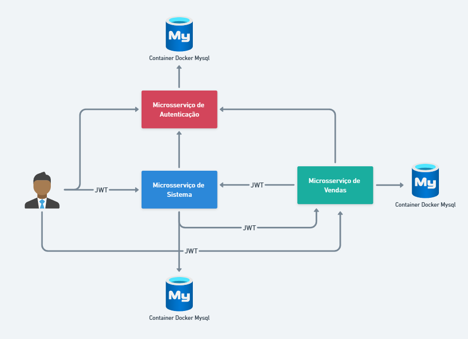

<h1 align="center">Autobots 🚗</h1>

<div align="center">
   <a href="https://github.com/JohnPetros">
    
   </a>
   
   <a href="https://github.com/JohnPetros/autobots/commits/main">
    
   </a>
  </a>
   </a>
   <a href="https://github.com/JohnPetros/autobots/blob/main/LICENSE.md">
    
   </a>
    
</div>
<br>

## Sobre o projeto

Autobots é um sistema backend desenvolvido para o gerenciamento de vendas de peças e serviços automotivos. O desenvolvimento do projeto foi dividido em cinco branches funcionais, cada uma representando uma etapa distinta e evolutiva do projeto. São elas:
- **atvi**: CRUD de clientes.
- **atvii**: Padronização de respostas de rota e [HATEOUS](https://www.treinaweb.com.br/blog/o-que-e-hateoas). 
- **atviii**: CRUD de empresas, mercadorias, serviços e veículos com validação de dados.
- **atviv**: Autenticação e autorização via [Json Web Token (JWT)](https://www.treinaweb.com.br/blog/o-que-e-jwt).
- **atvv**: Microsserviços.

---

## Arquitetura de Microsserviços

<div>
  
</div>

## Guia de instalação da Atvv

### Pré-requisitos

- [Git](https://git-scm.com/)
- [Java](https://www.python.org/) pelo menos igual ou acima da versão 21.
- [Maven](https://maven.apache.org/) pelo menos igual ou acima da versão 3.6.3.
- [Docker](https://www.docker.com/) pelo menos igual ou acima da versão 28.2.2.

### Clone o repositório

```bash
git clone https://github.com/JohnPetros/autobots.git
```

### Acesse o projeto

```bash
cd /autobots/autenticacao
```

### Execute os containers MySql com Docker

```bash
docker compose -d
```

### Acesse o microsserviço de autenticação

```bash
cd /autenticacao
```

### Execute o microsserviço de autenticação

```bash
mvn spring-boot:run
```

> O microsserviço de vendas estará rodando no endereço http://localhost:8081

### Acesse o microsserviço de vendas

```bash
cd /vendas
```

### Execute o microsserviço de vendas

```bash
mvn spring-boot:run
```

> O microsserviço de vendas estará rodando no endereço http://localhost:8082

### Acesse o microsserviço de sistema

```bash
cd /sistema
```

### Execute o microsserviço de sistema

```bash
mvn spring-boot:run
```

> O microsserviço de sitema estará rodando no endereço http://localhost:8080

### Testando rotas

- É possível também testar as rotas utilizando a extenção [Rest Client](https://marketplace.visualstudio.com/items?itemName=humao.rest-client). As rotas de teste estão na pasta `/rotas`.
- É possível ver a documentação das rotas feita com [Swagger](https://swagger.io/) acessando a rota swagger-ui/index.html de cada microsserviço.

---
